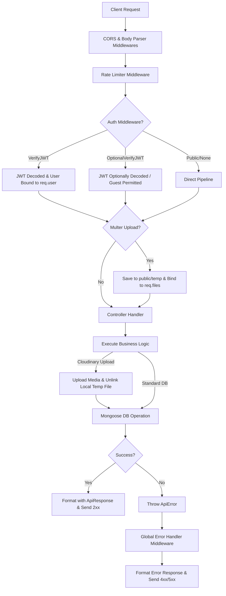
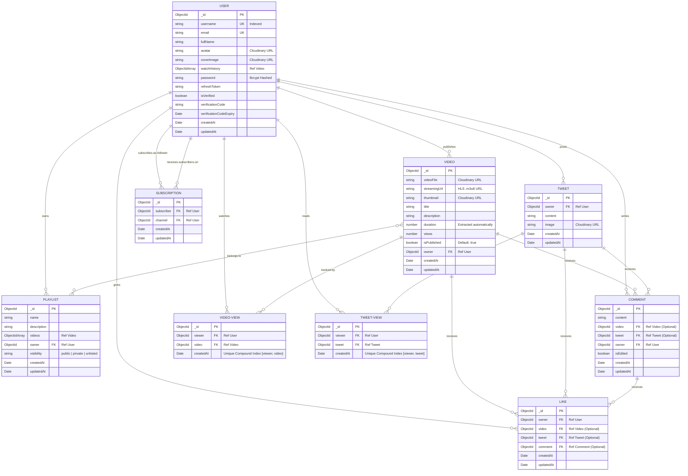

# 🎥 JustTube Backend

[](https://nodejs.org/)
[](https://expressjs.com/)
[](https://mongoosejs.com/)
[](https://cloudinary.com/)
[](https://jwt.io/)
[](https://vercel.com/)

Welcome to **JustTube Backend**, a production-grade, highly optimized RESTful API service built to power a modern hybrid video-sharing and microblogging (Twitter-like) social platform. The service is architected to handle complex user interactions, media processing, social networking connections, and real-time dashboard analytics under heavy workloads.

This backend serves as a robust foundation utilizing the **MVC (Model-View-Controller)** pattern, rich pipeline aggregation through **Mongoose**, secure cookie-based **JWT Authentication**, and automated media pipelines via **Multer** and **Cloudinary**.

---

## 🚀 Key Features

*   **🔒 Secure Multi-Layer Auth:** Split token architecture (Access + Refresh Tokens) with secure HTTP-only cookies, password hashing (bcrypt), and granular route protection (`VerifyJWT` / `OptionalVerifyJWT`).
*   **📧 OTP Email Verification:** Complete registration verification using NodeMailer with dynamic HTML templates and strict 10-minute expiration policies.
*   **🎥 Advanced Video Pipeline:** Multi-part file uploads (via Multer), automated background uploading to Cloudinary, duration extraction, togglable publication status, and paginated searches.
*   **🐦 Microblogging (Tweets):** Twitter-like text posts with optional image attachments uploaded directly to Cloudinary.
*   **💬 Dual Comment System:** Seamless comment sections for both videos and tweets, fully guarded against cross-resource duplication.
*   **👍 Unified Likes Engine:** Polymorphic liking system allowing users to like videos, tweets, or individual comments.
*   **📁 Custom Playlists:** User-created video collections with custom metadata and granular visibility controls (`public`, `private`, `unlisted`).
*   **🔔 Subscription Network:** A robust follower-following graph enabling user subscriptions and automated subscription feed aggregation.
*   **📊 Channel Dashboard & Analytics:** High-performance MongoDB aggregation pipelines computing total channel views, subscriber counts, total likes, and detailed video performance.
*   **🛡️ Reliability & Security:** Express rate limiting on sensitive actions (like OTP resends), custom API error boundary handling, and clean global error interception.

---

## 📁 System Architecture & Directory Flow

JustTube utilizes a highly structured, scalable MVC architecture to separate concerns, ensure testability, and simplify maintenance.

```text
📂 02project
 ├── 📂 public/              # Local temp storage for uploads (cleared post-Cloudinary)
 └── 📂 src/
      ├── 📂 controllers/    # Business & application logic handlers
      ├── 📂 db/             # MongoDB database connection configurations
      ├── 📂 middlewares/    # Custom Express middlewares (Auth, Uploads, Rate Limiter)
      ├── 📂 models/         # Mongoose Schemas & hooks (User, Video, Tweet, etc.)
      ├── 📂 routes/         # Express API Router definitions
      ├── 📂 utils/          # Standardized classes & utility helper functions
      ├── 📄 app.js          # Express app initialization & middleware stack configuration
      ├── 📄 constants.js    # System-wide constants & configurations
      └── 📄 index.js        # Main server entry point (DB connection & HTTP listener)
```

### 🔁 Request-Response Lifecycle Flow
Every incoming request follows a secure, deterministic middleware pipeline before returning a response:



---

## 📊 Database Schema & Entity Relations (ERD)

The database schema is designed for high-performance indexing and fast lookups, utilizing **Mongoose schemas** with compound indexes and pagination plug-ins.



### 🔍 Crucial Design Decisions in the Schema:
1.  **Polymorphic Comments:** The `Comment` schema supports commenting on either a `video` or a `tweet`. A `pre("validate")` hook ensures that a comment cannot belong to both, preserving clean relations.
2.  **Polymorphic Likes:** The `Like` schema utilizes a single table structure where each record has a reference to the `owner` (User) and exactly one of `video`, `tweet`, or `comment`, eliminating the need for three separate tables.
3.  **Spam-Resistant Views:** Both `VideoView` and `TweetView` models utilize a compound unique index: `videoViewSchema.index({ viewer: 1, video: 1 }, { unique: true })`. This guarantees that a user's view is registered precisely once, avoiding view inflation.
4.  **Optimized Subscriptions:** Subscriptions are decoupled into a separate collection mapping a `subscriber` to a `channel`. This prevents document size overflow limitations in MongoDB that would arise if subscribers were stored inside an array in the User model.

---

## 🛡️ Key Middlewares & Security Implementation

### 1. JWT Authentication Pipeline (`auth.middleware.js`)
We implement two separate layers of JWT verification depending on the accessibility of the endpoint:
*   **`VerifyJWT` (Strict):** Requires a valid Access Token passed via cookies or the `Authorization` header. Decodes the token, verifies validity against expiry, fetches the user from MongoDB (excluding password and refresh token fields), and attaches the user object to `req.user`. Throws a `401 Unauthorized` error on failure.
*   **`OptionalVerifyJWT` (Passive):** Decodes the token if present, allowing the controller to know which user is making the request (useful to see if they like a video, or are subscribed to the channel). If no token is provided, it silently passes execution with `req.user = null` instead of failing.

### 2. Multi-Part Media Uploads (`multer.middleware.js`)
Configured to securely handle multipart/form-data. It caches files locally in the `./public/temp` directory with randomized names to prevent collisions. Once the controller successfully uploads the file to Cloudinary, a clean-up function unlinks the file from local storage. In case of upload failures, the file is automatically unlinked to prevent disk space leaks.

### 3. Smart Rate Limiter (`ratelimiter.middleware.js`)
Protects against brute-force attacks on resource-expensive operations. For instance, the **Verification Code Resend** endpoint is guarded by a limiter that restricts users to a maximum of 3 requests per 15 minutes:
```javascript
export const VerificationResendLimiter = rateLimit({
    windowMs: 15 * 60 * 1000, // 15 minutes
    max: 3,
    handler: (req, res, next) => {
        throw new ApiError(429, "Too many resend attempts. Please try again after 15 minutes.");
    }
});
```

---

## 💻 Step-by-Step Installation & Deployment

### ⚙️ Prerequisites
*   [Node.js](https://nodejs.org/) (v20.0.0 or higher recommended)
*   [MongoDB Atlas](https://www.mongodb.com/cloud/atlas) cluster (or local MongoDB community server)
*   [Cloudinary](https://cloudinary.com/) account for image and video hosting
*   [Gmail Account](https://support.google.com/mail/answer/185833?hl=en) with App Password enabled for SMTP mailing

### 🛠️ Local Installation

1.  **Clone the Repository:**
    ```bash
    git clone https://github.com/Archisman2006/Backend-Project.git
    cd Backend-Project
    ```

2.  **Install Dependencies:**
    ```bash
    npm install
    ```

3.  **Configure Environment Variables:**
    Create a `.env` file in the root directory and populate it with your credentials:
    ```env
    PORT=8000
    MONGODB_URI=mongodb+srv://<username>:<password>@cluster0.mongodb.net
    CORS_ORIGIN=http://localhost:5173
    FRONTEND_CORS_ORIGIN=https://yourfrontenddomain.com
    
    ACCESS_TOKEN_SECRET=your_super_secret_access_token_key_here
    ACCESS_TOKEN_EXPIRY=1d
    REFRESH_TOKEN_SECRET=your_super_secret_refresh_token_key_here
    REFRESH_TOKEN_EXPIRY=10d

    CLOUDINARY_CLOUD_NAME=your_cloudinary_cloud_name
    CLOUDINARY_API_KEY=your_cloudinary_api_key
    CLOUDINARY_API_SECRET=your_cloudinary_api_secret

    SMTP_USER=your_gmail_address@gmail.com
    SMTP_PASS=your_gmail_16_digit_app_password
    ```

4.  **Start Dev Server:**
    Run the application locally in watch-mode using Nodemon:
    ```bash
    npm run dev
    ```
    The server will spin up and connect to MongoDB:
    ```text
    Server is running on port: 8000
    MONGODB Connected Successfully DB-HOST: cluster0.ixc6gso.mongodb.net
    ```

---

### ☁️ Production Deployment (Serverless via Vercel)

The codebase is pre-configured to deploy seamlessly to **Vercel Serverless Functions**.

1.  **Vercel Configuration (`vercel.json`):**
    The configuration maps all incoming routes to `src/index.js` while enabling proper caching headers and configurations.
    ```json
    {
      "version": 2,
      "builds": [
        {
          "src": "src/index.js",
          "use": "@vercel/node"
        }
      ],
      "routes": [
        {
          "src": "/(.*)",
          "dest": "src/index.js"
        }
      ]
    }
    ```

2.  **Serverless Connection Handling:**
    In serverless environments, standard long-running listeners are unnecessary. `src/index.js` handles this by checking the environment and exporting the app instead of binding ports when running under Vercel:
    ```javascript
    connectDB().then(() => {
        if (!process.env.VERCEL) {
            app.listen(process.env.PORT || 8000, () => {
                console.log("Server running on port: " + (process.env.PORT || 8000));
            });
        } else {
            console.log("Connected to MongoDB (Serverless Mode)");
        }
    });
    ```

3.  **Deployment Steps:**
    *   Install Vercel CLI: `npm install -g vercel`
    *   Log in and link repository: `vercel`
    *   Add all `.env` variables inside the Vercel Dashboard under **Project Settings -> Environment Variables**.
    *   Deploy to production: `vercel --prod`

---

## 📖 API Endpoint Reference

### 🔐 Authentication & User Management (`/api/v1/users`)

| Method | Endpoint | Auth | Files (Multer) | Description |
| :--- | :--- | :--- | :--- | :--- |
| **GET** | `/` | 🔓 Optional | None | Retrieve a paginated list of all registered users |
| **POST** | `/register` | 🔓 Optional | `avatar` (1), `coverImage` (1) | Register a new account (uploads files, sends OTP verification email) |
| **POST** | `/verify-email` | 🌐 Public | None | Verify user email by submitting the 6-digit OTP code |
| **POST** | `/resend-verification-code`| 🌐 Public | None | Resend a new OTP verification email (Rate limited: 3 requests/15m) |
| **POST** | `/login` | 🌐 Public | None | Authenticate user, returns Access + Refresh tokens in HTTP-only cookies |
| **POST** | `/logout` | 🔒 Required | None | Log out user, invalidates and clears cookies, resets refresh token in DB |
| **POST** | `/refresh-token` | 🌐 Public | None | Request new Access Token using valid Refresh Token |
| **POST** | `/change-password` | 🔒 Required | None | Change current user password |
| **GET** | `/current-user` | 🔓 Optional | None | Fetch details of the currently authenticated user |
| **PATCH**| `/update-details` | 🔒 Required | None | Update basic profile details (Full Name, Email) |
| **PATCH**| `/update-avatar` | 🔒 Required | `avatar` (1) | Update user profile avatar image on Cloudinary |
| **PATCH**| `/update-coverImage` | 🔒 Required | `coverImage` (1) | Update user profile cover image on Cloudinary |
| **GET** | `/channel/:username` | 🔓 Optional | None | Get public profile details of a channel by username |
| **GET** | `/history` | 🔒 Required | None | Fetch logged-in user's watch history |
| **DELETE**| `/history` | 🔒 Required | None | Clear entire watch history |
| **DELETE**| `/history/:videoId` | 🔒 Required | None | Remove a specific video from user watch history |

<details>
<summary>📦 View JSON Request/Response Payloads for Auth & Users</summary>

#### User Registration (`POST /register`)
*   **Request Type:** `multipart/form-data`
*   **Body:**
    *   `username`: `archisman`
    *   `email`: `archidas2006@gmail.com`
    *   `fullName`: `Archisman Das`
    *   `password`: `SecurePassword123`
    *   `avatar`: `[File Upload]`
    *   `coverImage`: `[File Upload - Optional]`
*   **Response (201 Created):**
    ```json
    {
      "statusCode": 201,
      "data": {
        "_id": "6475f92bf445b23ea0a1e0b1",
        "username": "archisman",
        "email": "archidas2006@gmail.com",
        "fullName": "Archisman Das",
        "avatar": "https://res.cloudinary.com/.../avatar.jpg",
        "coverImage": "https://res.cloudinary.com/.../cover.jpg",
        "isVerified": false,
        "createdAt": "2026-06-24T13:00:00.000Z"
      },
      "message": "User registered successfully! Please check your email for verification code.",
      "success": true
    }
    ```

#### Verify Email (`POST /verify-email`)
*   **Body:**
    ```json
    {
      "email": "archidas2006@gmail.com",
      "code": "123456"
    }
    ```
*   **Response (200 OK):**
    ```json
    {
      "statusCode": 200,
      "data": {},
      "message": "Email verified successfully.",
      "success": true
    }
    ```

#### User Login (`POST /login`)
*   **Body:**
    ```json
    {
      "email": "archidas2006@gmail.com",
      "password": "SecurePassword123"
    }
    ```
*   **Response (200 OK):**
    *Cookies `accessToken` and `refreshToken` are injected into the response headers.*
    ```json
    {
      "statusCode": 200,
      "data": {
        "user": {
          "_id": "6475f92bf445b23ea0a1e0b1",
          "username": "archisman",
          "email": "archidas2006@gmail.com",
          "fullName": "Archisman Das",
          "avatar": "https://res.cloudinary.com/.../avatar.jpg",
          "isVerified": true
        },
        "accessToken": "ey...",
        "refreshToken": "ey..."
      },
      "message": "User logged in successfully.",
      "success": true
    }
    ```
</details>

---

### 📹 Video Management (`/api/v1/videos`)

| Method | Endpoint | Auth | Files (Multer) | Description |
| :--- | :--- | :--- | :--- | :--- |
| **GET** | `/` | 🌐 Public | None | Retrieve a list of all published videos (Supports pagination & queries) |
| **POST** | `/` | 🔒 Required | `videoFile` (1), `thumbnail` (1) | Upload and publish a new video |
| **GET** | `/search` | 🌐 Public | None | Advanced search and filter videos by title, description, or owner |
| **GET** | `/:videoId` | 🔓 Optional | None | Retrieve metadata of a single video by ID |
| **POST** | `/:videoId` | 🔓 Optional | None | Register a view on a video (Throttled per viewer using unique compound indexes) |
| **PATCH**| `/:videoId` | 🔒 Required | `thumbnail` (1) | Update video details (Title, Description, or Thumbnail) |
| **DELETE**| `/:videoId` | 🔒 Required | None | Permanently delete a video (deletes media from Cloudinary) |

<details>
<summary>📦 View JSON Request/Response Payloads for Videos</summary>

#### Publish Video (`POST /api/v1/videos/`)
*   **Request Type:** `multipart/form-data`
*   **Body:**
    *   `title`: `Building a Microservices Architecture`
    *   `description`: `A deep dive into node serverless architecture.`
    *   `videoFile`: `[File Upload]`
    *   `thumbnail`: `[File Upload]`
*   **Response (201 Created):**
    ```json
    {
      "statusCode": 201,
      "data": {
        "_id": "6475f92bf445b23ea0a1e999",
        "title": "Building a Microservices Architecture",
        "description": "A deep dive into node serverless architecture.",
        "videoFile": "https://res.cloudinary.com/.../video.mp4",
        "thumbnail": "https://res.cloudinary.com/.../thumb.jpg",
        "duration": 342.12,
        "views": 0,
        "isPublished": true,
        "owner": "6475f92bf445b23ea0a1e0b1",
        "createdAt": "2026-06-24T13:05:00.000Z"
      },
      "message": "Video published successfully.",
      "success": true
    }
    ```
</details>

---

### 🐦 Tweet Management (`/api/v1/tweets`)

| Method | Endpoint | Auth | Files (Multer) | Description |
| :--- | :--- | :--- | :--- | :--- |
| **POST** | `/` | 🔒 Required | `image` (1) | Post a text tweet with an optional image attachment |
| **GET** | `/` | 🔓 Optional | None | Get a paginated feed of all global tweets |
| **GET** | `/:tweetId` | 🔓 Optional | None | Retrieve a single tweet by ID and register a unique view |
| **PATCH**| `/:tweetId` | 🔒 Required | `image` (1) | Update tweet content and/or replace its attached image |
| **DELETE**| `/:tweetId` | 🔒 Required | None | Delete a tweet and remove its assets from Cloudinary |

---

### 💬 Comment System (`/api/v1/comments`)

| Method | Endpoint | Auth | Description |
| :--- | :--- | :--- | :--- |
| **GET** | `/videos/:videoId` | 🔓 Optional | Get a paginated list of all comments under a video |
| **POST** | `/videos/:videoId` | 🔒 Required | Write a comment on a video |
| **PATCH**| `/videos/:commentId` | 🔒 Required | Edit a comment written on a video |
| **DELETE**| `/videos/:commentId` | 🔒 Required | Delete a comment written on a video |
| **POST** | `/tweets/:tweetId` | 🔒 Required | Write a comment on a tweet |
| **GET** | `/tweets/:tweetId` | 🔓 Optional | Get a paginated list of all comments under a tweet |
| **PATCH**| `/tweets/:commentId` | 🔒 Required | Edit a comment written on a tweet |
| **DELETE**| `/tweets/:commentId` | 🔒 Required | Delete a comment written on a tweet |

---

### 👍 Like System (`/api/v1/likes`)

| Method | Endpoint | Auth | Description |
| :--- | :--- | :--- | :--- |
| **GET** | `/videos` | 🔒 Required | Retrieve a list of all videos liked by the current user |
| **POST** | `/videos/:videoId` | 🔒 Required | Toggle like/unlike on a video |
| **POST** | `/tweets/:tweetId` | 🔒 Required | Toggle like/unlike on a tweet |
| **POST** | `/comments/:commentId`| 🔒 Required | Toggle like/unlike on a comment |

---

### 📁 Playlist Management (`/api/v1/playlists`)

| Method | Endpoint | Auth | Description |
| :--- | :--- | :--- | :--- |
| **POST** | `/` | 🔒 Required | Create a new playlist (Name, Description, and Visibility settings) |
| **GET** | `/` | 🔓 Optional | Retrieve all playlists (filters public playlists or user's owned playlists) |
| **GET** | `/:playlistId` | 🔓 Optional | Fetch details of a playlist by ID (contains populated video objects) |
| **PATCH**| `/:playlistId` | 🔒 Required | Update playlist metadata (Name, Description, Visibility) |
| **DELETE**| `/:playlistId` | 🔒 Required | Delete a playlist permanently |
| **POST** | `/:playlistId/:videoId`| 🔒 Required | Append a video into a playlist |
| **DELETE**| `/:playlistId/:videoId`| 🔒 Required | Remove a video from a playlist |

---

### 🔔 Subscription Network (`/api/v1/subscriptions`)

| Method | Endpoint | Auth | Description |
| :--- | :--- | :--- | :--- |
| **GET** | `/` | 🔒 Required | Get a feed of uploaded videos from channels the user is subscribed to |
| **GET** | `/subscribed-channels`| 🔒 Required | Retrieve the list of all channels the logged-in user is subscribed to |
| **POST** | `/:channelId` | 🔒 Required | Toggle subscribe/unsubscribe on a channel |
| **GET** | `/:channelId` | 🔒 Required | Fetch the subscriber list of a specific channel |

---

### 📊 Dashboard & Channel Analytics (`/api/v1/dashboard`)

| Method | Endpoint | Auth | Description |
| :--- | :--- | :--- | :--- |
| **GET** | `/:channelId` | 🔓 Optional | Fetch total views, total subscribers, total videos, and total likes for a channel |
| **GET** | `/videos/:username` | 🔓 Optional | Retrieve all videos published by a specific channel (paginated) |
| **GET** | `/tweets/:username` | 🔓 Optional | Retrieve all tweets posted by a specific channel (paginated) |
| **GET** | `/playlists/:username`| 🔓 Optional | Retrieve all playlists owned by a specific channel (paginated) |

---

## ⚙️ Technology Stack & Dependencies

The backend leverages a curated stack of modern packages configured for performance:

*   **Runtime:** [Node.js (v20+)](https://nodejs.org/)
*   **Web Framework:** [Express.js (v5.2.1)](https://expressjs.com/) - Leveraging Express 5 for enhanced routing and built-in promise error forwarding.
*   **Database ODM:** [Mongoose (v9.2.1)](https://mongoosejs.com/) - Schema modeling and high-performance aggregate matching.
*   **Media Storage CDN:** [Cloudinary SDK (v2.9.0)](https://cloudinary.com/) - Automated asset handling, media resizing, and video delivery optimization.
*   **Multipart Upload Handler:** [Multer (v2.0.2)](https://github.com/expressjs/multer) - Handling streams of binary files efficiently in memory/disk.
*   **Authentication:** [JSON Web Token (v9.0.3)](https://github.com/auth0/node-jsonwebtoken) and [Bcrypt (v6.0.0)](https://github.com/kelektiv/node.bcrypt.js) for robust credential protection.
*   **Security Utilities:** [Express Rate Limit (v8.5.2)](https://github.com/express-rate-limit/express-rate-limit) and [CORS (v2.8.6)](https://github.com/expressjs/cors).
*   **Email Engine:** [Nodemailer (v8.0.10)](https://nodemailer.com/) - Direct SMTP mailing integration with secure configurations.
*   **Pagination Plug-in:** [Mongoose Aggregate Paginate v2 (v1.1.4)](https://github.com/aravindnc/mongoose-aggregate-paginate-v2) - Seamless pagination over deep aggregation pipelines.